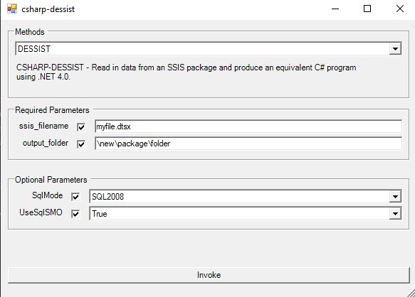

# csharp-dessist
This program reads an SSIS package and decompiles it into an executable C# project, with source code and comments preserved.

Download latest executable:
* https://github.com/tspence/csharp-dessist/raw/master/Releases/csharp-dessist-2.1.zip


# Example Usage

You can run this program directly using the Dot Net Framework.  It will show you a Windows Forms dialog
that allows you to browse to an SSIS file and convert it into a C# program.



# Command Line Usage
```
csharp-dessist.exe --ssis_filename=mypackage.dtsx --output_folder=c:\development\mypackage
```
# Reference

```
--ssis_filename - The filename of the DTSX file you wish to decompile.
--output_folder - The folder where DESSIST will create the resulting C#/.NET project.
--SqlMode - Either SQL2005 or SQL2008 (enables fast table parameter inserts on SQL2008).
--UseSqlSMO - For any SQL statements that include "GO" syntax to separate statements, use the SQL SMO objects to execute them explicitly in order. Default true; you can set this to false to attempt to automatically rewrite these commands into a single SQL statement for a minor performance improvement.
```

# Functionality
Nine years later, this program continues to be occasionally popular with people stuck managing old SSIS packages.

I've updated the program slightly and will publish it on NuGet.

As of 2013-01-18, this program creates fully functional and executable CSharp projects from my test suite of SSIS packages. The objects it can decompile are:

* Flat file data sources objects (CSV files)
* SSIS.Pipeline.2 constructs, including unions, transforms, reads, and writes
* Complex expressions including type conversions, concatenation, lineage and variable references
* Connection Strings
* SQL Statements
* Code organization
* Variables (global and local)
* Pipelines
* Embedded Script Tasks
* For, Foreach, and Sequence constructs
* Precedence order and expressions
* Variable passing between functions
* Variable scope (differing between local and globals)
* SMTP mail tasks

At this point, the DESSIST program should be capable of transforming your SSIS project into a fully functional C# program. However, you should still test and evaluate your program prior to replacing SSIS with C#.

DESSIST includes a few features not specifically included in SSIS, including:

* Table parameter inserts, for better performance on SQL 2008 environments
* A recursive time log that reports the amount of time spent in each element of the project
* Console output suitable for diagnostics and performance tuning

# In Development
Features currently in development include:

* SSIS Event Handlers
* Exception handling
* Parallelization for functions without dependencies
* Command line options to switch between SQL 2005 and 2008 compatibility modes

# How can you help?
The project needs copies of SSIS packages for experimentation. Drop me a message or submit your favorite DTS package in zipped form and we'll use that for tests!
